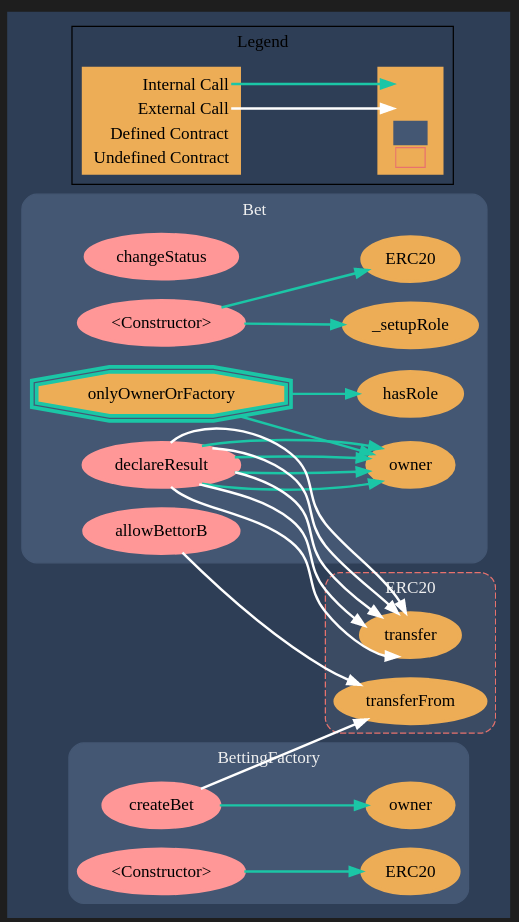

### Contracts

### Setting up

```
cp .example.env .env
```

Put env variable for infura-api.
Create `.secret` and place mnemonic of a wallet or one given in npm run generate in [package.json](./package.json#L12).

## Running tests:

```
npm i
npm run test:ethereum
npm run generate
npx tsc -p .
truffle test
```

## Migrations

```
npm run migrate
```

<!--  -->

# Betting Factory

-   Deploy betting contract

# Bet

-   Allows two bettors.
-   An oracle declares a result.
-   Bets can be created by a user.
